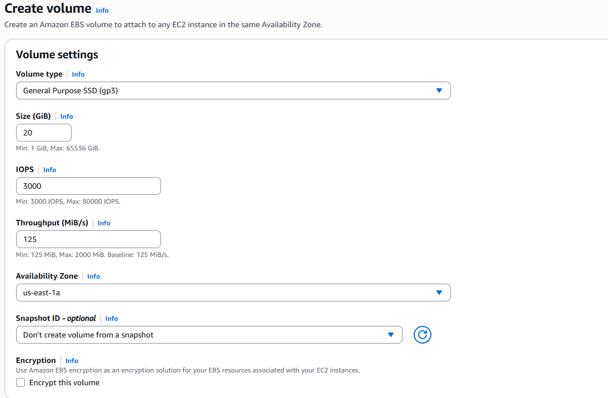
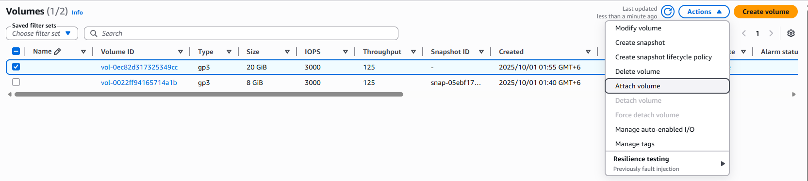
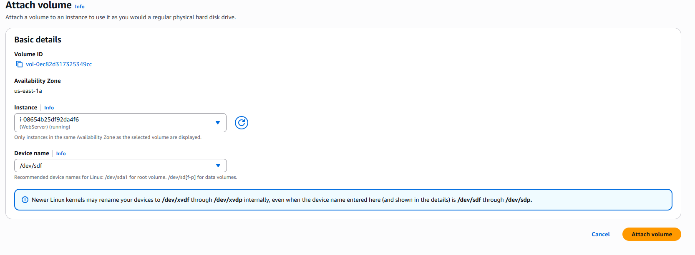
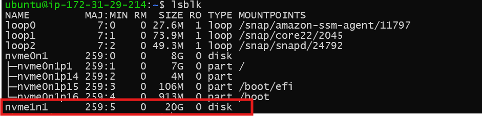
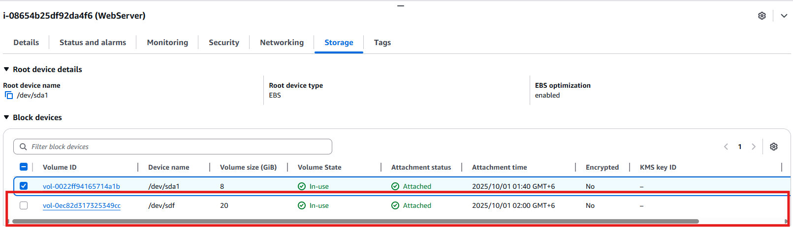

# Step-by-Step: Attaching and Expanding an EBS Volume to EC2
This guide provides detailed, step-by-step instructions for attaching and mounting a new Amazon EBS volume and expanding an existing EBS volume to a running EC2 instance using the AWS Console.

## Prerequisites  
  
- An AWS account with access to EC2 and EBS  
- A running EC2 instance  
- Appropriate IAM permissions  
  
## Steps  
  
### 1. Launch an EC2 Instance (if not already running)  
  
1. Go to the [AWS EC2 Console](https://console.aws.amazon.com/ec2/).  
2. Click **Instances** > **Launch Instances**.  
3. Select an AMI, instance type, and configure as needed.  
4. Add storage (default root volume is fine).  
5. Configure security group and key pair.  
6. Launch the instance and wait until it is running.

### 2. Identify the Instance’s Availability Zone  
  
1. In the EC2 Console, select your instance.  
2. Note the **Availability Zone** (e.g., `us-east-1a`) in the details.

### 3. Create a New EBS Volume  
  
1. In the sidebar, click **Elastic Block Store > Volumes**.  
2. Click **Create Volume**. 
    
3. Set the size, type, and **Availability Zone** (must match your instance).  
4. Click **Create Volume**.  
  
### 4. Attach the EBS Volume to the Instance  
  
1. Select the new volume in the Volumes list.  
2. Click **Actions > Attach Volume**.  
    
---
3. Select your instance and specify a device name (e.g., `/dev/xvdf`). 
 
     
---
4. Click **Attach**.  

  
### 5. Connect to Your EC2 Instance  
  
```bash  
ssh -i /path/to/your-key.pem ec2-user@<instance-public-ip>
```

### 6. Prepare and Mount the new EBS Volume

- List block devices using the command: `lsblk`
     
    

- create a directory to be used as the mount point:
    ```bash
    sudo mkdir /mnt/ebs-volume
    ```
-  Now use the below command to create a filesystem on the attached volume:
    ```bash
    mkfs -t ext4 /dev/nvme1n1
    ```
    ```bash
    # output:
    ubuntu@ip-172-31-29-214:~$ mkfs -t ext4 /dev/nvme1n1
    mke2fs 1.47.0 (5-Feb-2023)
    Creating filesystem with 5242880 4k blocks and 1310720 inodes
    Filesystem UUID: 53b98de6-49c4-49e9-a195-6178a685c68c
    Superblock backups stored on blocks:
            32768, 98304, 163840, 229376, 294912, 819200, 884736, 1605632, 2654208,
            4096000

    Allocating group tables: done
    Writing inode tables: done
    Creating journal (32768 blocks): done
    Writing superblocks and filesystem accounting information: done
    ```
- Verify the file system:
  
  ```bash
  ubuntu@ip-172-31-29-214:~$ file -s /dev/nvme1n1

  #output

  /dev/nvme1n1: Linux rev 1.0 ext4 filesystem data, UUID=53b98de6-49c4-49e9-a195-6178a685c68c (extents) (64bit) (large files) (huge files)
  ```

- Mount the EBS volume to the specified mount point:
  ```bash
  mount /dev/nvme1n1 /mnt/ebs_volume/
  ```
- Check the new EBS volume mounted to the directory created in the earlier steps:

  ```bash
    ubuntu@ip-172-31-29-214:~$ df -h
    Filesystem       Size  Used Avail Use% Mounted on
    /dev/root        6.8G  1.8G  5.0G  26% /
    tmpfs            458M     0  458M   0% /dev/shm
    tmpfs            183M  888K  182M   1% /run
    tmpfs            5.0M     0  5.0M   0% /run/lock
    efivarfs         128K  3.6K  120K   3% /sys/firmware/efi/efivars
    /dev/nvme0n1p16  881M   87M  733M  11% /boot
    /dev/nvme0n1p15  105M  6.2M   99M   6% /boot/efi
    tmpfs             92M   12K   92M   1% /run/user/1000
    /dev/nvme1n1      20G   24K   19G   1% /mnt/ebs_volume

    ubuntu@ip-172-31-29-214:~$ lsblk
    NAME         MAJ:MIN RM  SIZE RO TYPE MOUNTPOINTS
    loop0          7:0    0 27.6M  1 loop /snap/amazon-ssm-agent/11797
    loop1          7:1    0 73.9M  1 loop /snap/core22/2045
    loop2          7:2    0 49.3M  1 loop /snap/snapd/24792
    nvme0n1      259:0    0    8G  0 disk
    ├─nvme0n1p1  259:1    0    7G  0 part /
    ├─nvme0n1p14 259:2    0    4M  0 part
    ├─nvme0n1p15 259:3    0  106M  0 part /boot/efi
    └─nvme0n1p16 259:4    0  913M  0 part /boot
    nvme1n1      259:5    0   20G  0 disk /mnt/ebs_volume
  ```

  ### 7. Configure automatic mount on boot:
  ```bash
  vi /etc/fstab
  ```
- Add the following entry to the file to ensure the volume is mounted automatically on boot:

  ```bash
  /dev/nvme1n1   /mnt/ebs_volume   ext4   defaults,nofail   0   2
  ```
  Save and exit the editor.

  Verify on the AWS console the new EBS volume has been successfully added and mounted:

    

  ---
### Addressing "No Space Left on Device" Issue on EC2

To address the "no space left on device" issue, follow these steps:

#### Check Disk Usage
First, use the command `df -h` to check the disk usage of your EC2 instance. Identify which partitions are full.

#### Increase the Volume Size
- Navigate to the AWS Management Console.
- Go to the EC2 instance and select the volume that you want to increase.
- Click on "Actions" and then select "Modify Volume".
- Increase the size (e.g., from 8GB to 30GB) and confirm the changes.

#### Wait for the Volume State to Update
After modifying, wait for the new volume size to reflect as "In Use" in the AWS Console. It may take around 10-15 minutes for the status to change.

#### Resize the File System
Once the volume is updated, connect to your EC2 instance via SSH.
- Run `lsblk` to check the available block devices to ensure the volume size has been updated.
- Use the commands:
  - `sudo growpart /dev/nvme0n1 1` to resize the partition (replace 1 with the appropriate partition number if needed).
  - Then use `sudo resize2fs /dev/nvme0n1p1` (replace with your partition path if different) to resize the file system.

#### Verify Changes
Run `df -h` again to confirm that additional space is now available on the device.

This process ensures that you can resolve the "no space left on device" issue effectively.
